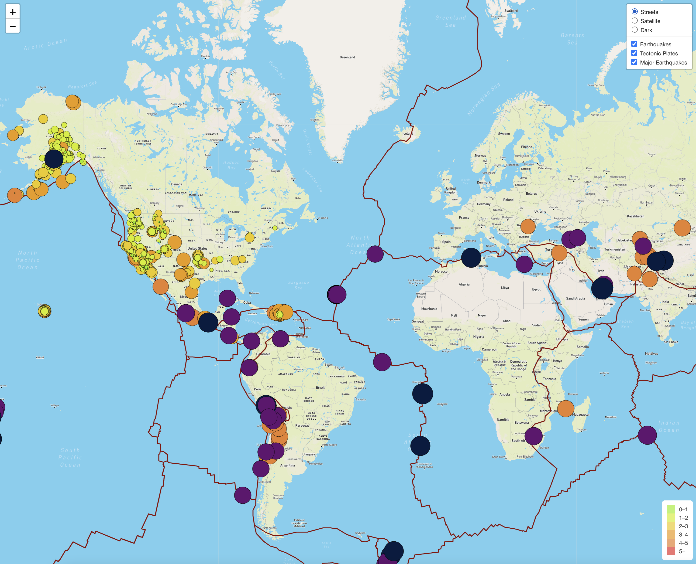

# Mapping Earthquakes

## Javascript, Mapbox API, and Leaflet are used to create a map visualization of USGS earthquake data from the past 7 days. 

Mapbox API provides us with variations of the tile layers to display different map styles. We use Leaflet, a javascript library, to add functionality to our map. With Leaflet, we create the base layers, overlays, markers, and the legend. We use the `d3.json()` method from the d3 javascript library to load the earthquake data from USGS and a dataset of the tectonic plates from a GitHub user. 

The map has map styles that the user can select from: streets, satellite, and dark. There are also three overlays that the user can toggle on and off. The overlay, `Earthquakes` show all earthquakes that occurred in the past seven days. The circle markers are color coded by magnitude. There is a legend at the bottom right of the page describing the magnitude associated with each color. The second overlay option, `Tectonic Plates` outline the earth's tectonic plates showing fault lines where earthquakes typically occur. The final overlay, `Major Earthquakes` shows earthquakes over a magnitude of 4.5 that occurred in the past 7 days. These earthquakes are color coded into three categories. Earthquakes that are a magnitude of 4.5 - 5 are purple, 5 - 6 are a dark navy, and magnitudes higher than 6 are periwinkle blue. Users can easily select which overlays they would like to display by checking and unchecking the appropriate boxes in the top right corner of the page. 

